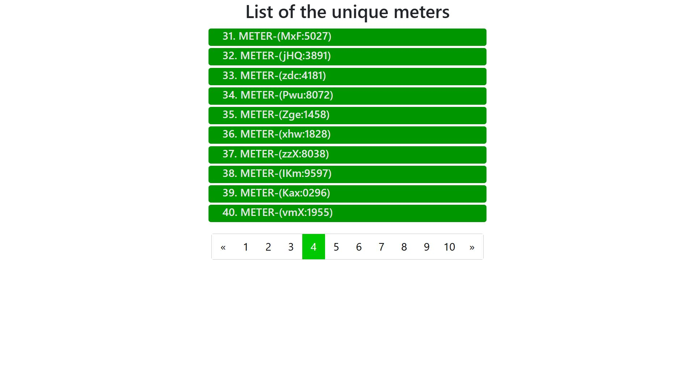
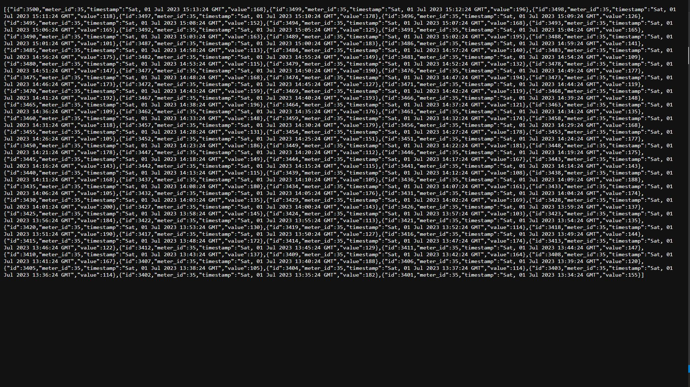

# Live Building Systems - Coding Challenge - Part1
<h2>1. Desription</h2>
Live Building Systems 2018
Coding Challenge - Part 1/2 Back End:

<pre>
Goal: Spin up a basic Flask application, connect it to a local SQLite database, add fake meter
data to the db, then implement a RESTful application for displaying the fake meter data in .json
format.


DB Schema:
  Table: : ”meters”
  Fields:
    “id”: Int - Primary Key
    “label”: String - name of meter
    
  Table: “meter_data”
  Fields:
    “id”: Int - Primary Key
    “meter_id”: Int - foreign key to associate MeterData entry to specific Meter
    “timestamp”: python DateTime object - timestamp of meter_data entry
    “value”: int - represents the value we are storing for a specific time for that meter


The application should be able to respond to the following queries:


Endpoint: /meters/
Should display a list of the unique meters in the DB. Each one should be a clickable link
that then points to the meter’s .json page that displays all of it’s associate data. So if I click on
the “Meter X” link it should point to the /meters/x/ url/endpoint.


Endpoint: /meters/{METER_ID}
Should display a list sorted by timestamp of all the datapoint entries from the meter_data
in json format for the specific meter_id passed into the URL as a parameter.
</pre>


<h2>2. Build and Run</h2>
<hr>
<b>Steps - Using Docker Compose</b>
<br>
<ol>
<li>Install Docker (Ignore if already installed)
<li>Go to main folder - ```app.py```</li>
<li>Run this docker command - ```docker compose up -d```</li>
</ol>
<br>
<b>Steps - Using python</b>
<br>
<ol>
<li>Install Python Version >= 3.9</li>
<li>Install Poetry - ```pip3 install poetry```</li>
<li>Install Modules - ```poetry install```</li>
<li>Run App - ```poetry run python app.py```</li>
</ol>


<b>Website Pages</b>

<h3>Page 1 - Displays Meter Names ("/meters")
</img>


<h3>Page 2 - Sorted Meter Data JSON Response ("/meters/meter_id")
</img>


<b>Tasks List</b>
- [x] Initialized Flask App
- [x] Connect To Local SQLite Database
- [x] Add Fake Data to DB
- [x] Implement RESTful Application
- [x] Created Meter and MeterData Models
- [x] Sorted JSON response from Latest to historical order
- [x] Created Tempaltes and Static Folders
- [x] Added Pagination to "/meters" Page
- [x] Getting Paginated Response from API
- [x] Added CSS Styling
- [x] Added Dockerfile
- [x] Added Docker Compose File
- [x] Updated Readme.md File

